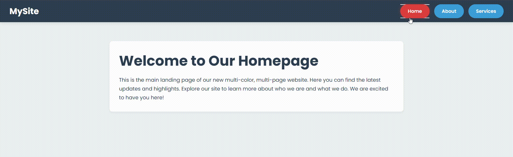

# Sigma Web Development - Exercise 4: Multi-Page Site with Animated Navigation

This repository contains my solution for Exercise 4 of the Sigma Web Development course. The project is a functional multi-page website featuring a stylish and highly animated navigation bar, built using HTML and advanced CSS techniques.

---

## 🚀 Project Highlights

This exercise demonstrates the creation of a cohesive multi-page user experience with a focus on interactive navigation elements.

- **Multi-Page Structure:** Fully navigable site with Home, About, and Services pages.
- **External CSS & Variables:** Clean code organization with a single stylesheet and effective use of CSS custom properties (variables) for theming.
- **Advanced Navigation Animations:**
    - **Expanding Border Effect:** Borders animate outwards on hover.
    - **Text Color & Scale Transition:** Smooth text color change and slight scaling on hover.
    - **Pulsing Active Link:** The currently active page link has a subtle, continuous pulse.
    - **Click Feedback:** Buttons provide clear visual feedback when clicked.
- **Page Load Animation:** Main content sections fade in smoothly on page load.
- **Responsive Foundation:** Basic responsive setup with viewport meta tag.

## 🛠️ Key CSS Techniques Implemented

- CSS Custom Properties (Variables) for theming and easy maintenance.
- Flexbox for layout (navigation bar, content centering).
- Advanced CSS Selectors (`:hover`, `:active`, `.active`).
- CSS Transitions for smooth property changes.
- CSS Keyframe Animations (`@keyframes`) for page load and active button pulse.
- Pseudo-elements (`::before`, `::after`) for creative hover effects (expanding borders).

## 📄 Project Files

- `index.html`: The homepage.
- `about.html`: The about page.
- `services.html`: The services page.
- `style.css`: Contains all the styling and animations for the entire site.

## 🙏 Acknowledgements

- This project is part of the **Sigma Web Development Course** by **CodeWithHarry**, which provides excellent guidance on modern web development practices.
